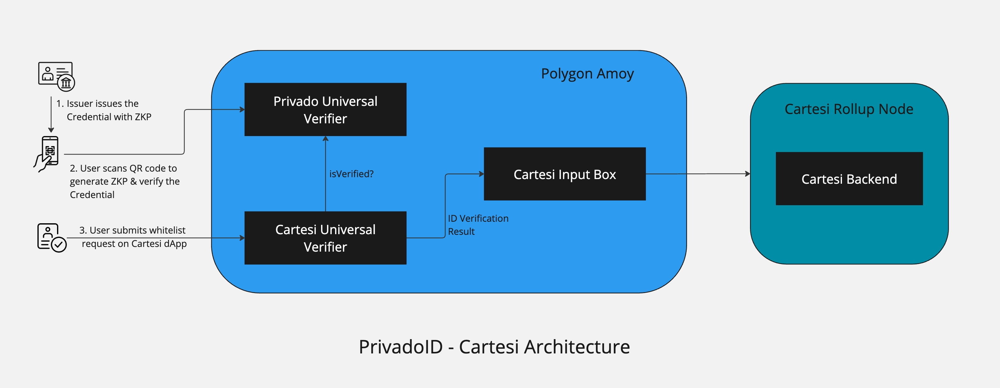

# Cartesi-Privado

A simple DApp template which has [PrivadoID](https://docs.privado.id/docs/introduction/) as the KYC layer to authenticate new users & [Cartesi](https://docs.cartesi.io/cartesi-rollups/1.3/) backend to offload complex computation offchain.

[Example - App](https://decentra-sign-frontend.vercel.app/)

## Privado ID

[PrivadoID](https://docs.privado.id/docs/introduction/), with the help of zero-knowledge proofs, lets users prove their identity without the need of exposing their private information. This ensures both the Freedom of Expression and Privacy by Default (user's identities are secured by zero-knowledge cryptography).

## Cartesi

At its core, the [Cartesi](https://docs.cartesi.io/cartesi-rollups/1.3/) Rollup executes the Cartesi Machine - a robust RISCV deterministic emulator running Linux OS - fueled by ordered inputs and custom application code. Inputs sourced from the data availability layer are read by the Cartesi Node, inside of which the Cartesi Machine processes them and generates outputs. After the optimistic rollup dispute window passes, these outputs are verifiable and possibly executable on the settlement layer.
The Cartesi Rollup framework is application-specific, assigning each dApp its rollup app chain and CPU while linking its optimistic rollups' consensus directly to the base layer

## Architecture



## Deploying DApp application

### build the Cartesi Dapp

`cd backend && cartesi build`

### Create Template Hash

`cartesi deploy --hosting self-hosted --webapp https://sunodo.io/deploy`

### deploy to the dapp to the Polygon Amoy testnet

`replace the variables 'templateHash' && 'salt' in scripts/deploy_dapp.js`

```
cd on-chain-verification

npx hardhat run ./scripts/deploy_dapp.js --network amoy

```

## Polygon ID Wallet setup

1. Download the Polygon ID mobile app on the [Google Play](https://play.google.com/store/apps/details?id=com.polygonid.wallet) or [Apple app store](https://apps.apple.com/us/app/polygon-id/id1629870183)

2. Open the app and set a pin for security

3. Issue yourself a Credential of type `Kyc Age Credential Merklized` from the [Polygon ID Issuer Sandbox](https://issuer-ui.polygonid.me/)
   - Import json schema[v3](https://raw.githubusercontent.com/iden3/claim-schema-vocab/main/schemas/json/KYCAgeCredential-v3.json)
   - Issue credential https://issuer-ui.polygonid.me/credentials/issue using the credential link and fetch credential to mobile

## Frontend

### Install & run

```
cd frontend
yarn
yarn run dev
```

### Deployments

[Example-App-Live-demo](https://decentra-sign-frontend.vercel.app/)

[Example-App-Video-demo](https://drive.google.com/file/d/1vfqxyS7KILsdzY_lqxIWFKKrmD7MLXC2/view?usp=sharing)
